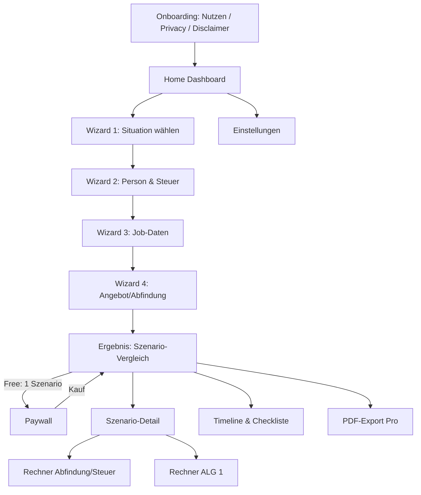

# ExitKompass – Produktspezifikation v1.0

**Karriere-Finanz-App für Kündigung, Aufhebungsvertrag, Abfindung & ALG 1 (Deutschland)**
Stand: Juli 2026 · Plattformen: iOS + Android (Flutter) · Modell: Freemium + Einmalkauf

---

## 1. Produktvision & Positionierung

**One-Liner:** „Kündigung oder Aufhebungsvertrag auf dem Tisch? ExitKompass rechnet in 5 Minuten alle Szenarien netto durch – 100 % lokal auf deinem Gerät."

**Kernproblem:** Wer eine Kündigung oder einen Aufhebungsvertrag erhält, muss unter Zeitdruck (3-Wochen-Klagefrist!) eine Entscheidung im Wert von zehntausenden Euro treffen. Die relevanten Effekte – Fünftelregelung, Sperrzeit, Ruhen des ALG-Anspruchs, Progressionsvorbehalt – verteilen sich auf Anwalts-Websites, Behördenseiten und werbeverseuchte Einzelrechner. **Keine App führt das zusammen.**

**USPs:**
1. **Szenario-Vergleich statt Einzelrechner** – 4 Handlungsoptionen nebeneinander, als Netto-Gesamtsumme über 24 Monate
2. **Privacy by Design** – kein Konto, keine Cloud, alle Daten bleiben auf dem Gerät (starkes Verkaufsargument in DE)
3. **DACH-Tiefe** – Fünftelregelung inkl. Veranlagungshinweis, Sperrzeit-/Ruhens-Logik, Progressionsvorbehalt
4. **Fristen-Timeline** – die App sagt, was bis wann zu tun ist

**Zielgruppe:** Angestellte 30–60 Jahre, Brutto ab ~50 T€, akut in Trennungssituation. Sekundär: Karriere-Coaches, Outplacement-Berater (B2B ab v1.2).

**Nicht-Ziele im MVP:** keine Rechts-/Steuerberatung, keine Rentenberechnung, kein Österreich/Schweiz, keine Selbstständigen.

---

## 2. Feature-Spezifikation

### 2.1 Free-Tier (Akquise-Funnel)
- Situations-Wizard (vollständig durchlaufbar)
- **1 Szenario** als Grobschätzung (gerundete Werte, ohne Detail-Aufschlüsselung)
- Fristen-Übersicht (statisch, ohne Erinnerungen)
- Wissens-Snippets (Was ist die Fünftelregelung? Was ist eine Sperrzeit?)

### 2.2 Pro (Einmalkauf, non-consumable)
- **Alle 4 Szenarien** mit Vergleichsansicht und Cashflow-Verlauf
- Abfindungs-Steuerrechner mit Fünftelregelung-Toggle (mit/ohne)
- ALG-1-Detailrechner (Anspruchsdauer, Sperrzeit-Effekt, Ruhen nach § 158 SGB III)
- Was-wäre-wenn-Regler: Abfindungshöhe, Austrittsdatum, Neue-Job-Startdatum
- Timeline mit lokalen Push-Erinnerungen (Fristen)
- **PDF-Export** („Mein Entscheidungs-Dossier" – fürs Anwalts-/HR-Gespräch)

### 2.3 Roadmap v1.1+
- Verhandlungs-Modul (übliche Abfindungshöhen: Faustformel 0,5 Bruttomonatsgehälter × Beschäftigungsjahre; Argumentationsbausteine)
- Progressionsvorbehalt-Jahressimulation (ALG + Restjahr-Gehalt + Abfindung im selben Jahr vs. Verschiebung ins Folgejahr)
- Steuerklassen-Hinweismodul vor ALG-Bezug (Achtung: BA prüft Zweckmäßigkeit bei Wechsel – nur als Info, keine Empfehlung)
- Englische Version für Expats in DE (unterversorgte Sub-Nische!)
- B2B-Coach-Modus (Mehrfach-Mandanten, White-Label-PDF)

---

## 3. Die vier Kern-Szenarien

| # | Szenario | Kernlogik |
|---|----------|-----------|
| S1 | **Kündigung durch AG erhalten** (Klage/Vergleich mit Abfindung) | Gehalt bis Fristende + Abfindung (Fünftelregelung) + ALG 1 ohne Sperrzeit |
| S2 | **Aufhebungsvertrag** (mit/ohne Freistellung bis reguläres Fristende) | Wie S1, aber Sperrzeit-Risiko-Flag; bei verkürzter Frist: Ruhen nach § 158 |
| S3 | **Eigenkündigung** | Sperrzeit 12 Wochen + Minderung der Anspruchsdauer um ¼; kein Abfindungsanspruch |
| S4 | **Bleiben** (Referenz-Baseline) | Netto-Gehaltsfortschreibung über Betrachtungszeitraum |

**Output je Szenario:** kumulierte Netto-Summe über wählbaren Horizont (Default 24 Monate), monatlicher Cashflow-Verlauf (Chart), Risiko-Flags (z. B. „Sperrzeit wahrscheinlich", „Krankenversicherung in Lücke klären").

---

## 4. Screen-Flow



### Screen-Katalog (14 Screens)

**0 – Onboarding (3 Karten):** Nutzenversprechen → „Alles bleibt auf deinem Gerät" → Disclaimer mit aktiver Zustimmung (Pflicht-Checkbox: „Keine Steuer-/Rechtsberatung, Schätzwerte").

**1 – Home:** Karte „Meine Situation" (Status + Kernzahl), CTA „Szenarien ansehen", darunter Fristen-Widget (nächste 2 Deadlines), Wissens-Feed.

**2 – Wizard „Situation":** 4 große Auswahlkarten (Kündigung erhalten / Aufhebung angeboten / Ich überlege zu kündigen / Nur informieren). Bestimmt Szenario-Defaults.

**3 – Wizard „Person & Steuer":** Geburtsjahr · Steuerklasse (I–VI) · Kinderfreibeträge · Kirchensteuer j/n + Bundesland · GKV (Zusatzbeitrag %) oder PKV (Monatsbeitrag) · Kinder für ALG-Satz (60/67 %).

**4 – Wizard „Job":** Bruttomonatsgehalt · variable Bezüge/13. Gehalt · Eintrittsdatum (→ Betriebszugehörigkeit) · Kündigungsfrist (Dropdown gesetzlich/vertraglich) · frühestmögliches reguläres Enddatum (auto-berechnet, editierbar).

**5 – Wizard „Angebot":** Abfindung brutto € · Austrittsdatum lt. Angebot · Freistellung j/n (bezahlt) · Resturlaub/Boni-Abgeltung €. Bei S3/S4 wird dieser Schritt übersprungen bzw. reduziert.

**6 – Ergebnis „Szenario-Vergleich":** horizontale Balken (Netto-Gesamtsumme je Szenario), beste Option markiert, Delta zur Baseline. Free-User sieht 1 Balken + 3 geblurrte → Paywall-Trigger. Regler oben: Betrachtungszeitraum 12/24/36 Monate.

**7 – Szenario-Detail:** Aufschlüsselung in Blöcke (Gehalt bis X · Abfindung netto · ALG-Phase · Lücken), jede Annahme antippbar & editierbar, Risiko-Flags mit Erklärtext.

**8 – Rechner „Abfindung & Steuer":** Eingabe Abfindung + zu versteuerndes Resteinkommen im Auszahlungsjahr → Ausgabe: Steuer mit vs. ohne Fünftelregelung, Ersparnis-Betrag, Hinweis-Banner: *„Seit 2025 wendet der Arbeitgeber die Fünftelregelung nicht mehr im Lohnsteuerabzug an – du holst dir die Ersparnis über die Steuererklärung zurück."* + Tipp-Karte „Auszahlung ins Folgejahr verschieben?".

**9 – Rechner „ALG 1":** Bemessungsentgelt (gedeckelt auf BBG) → pauschaliertes Netto → 60 %/67 % → Monatsbetrag + Anspruchsdauer nach Alter/Vorversicherungszeit; Toggle „Sperrzeit simulieren" zeigt Verlust in € und Wochen.

**10 – Timeline & Checkliste:** chronologische Karten mit Datum, z. B. Arbeitsuchendmeldung (spätestens 3 Monate vor Ende bzw. binnen 3 Tagen nach Kenntnis, § 38 SGB III) · Klagefrist Kündigungsschutzklage 3 Wochen (§ 4 KSchG) · Arbeitslosmeldung Tag 1 · KV-Anschluss klären · Zeugnis anfordern. Pro: Häkchen + lokale Push-Erinnerung.

**11 – Paywall:** Ein Preis, Einmalkauf. Headline: „Schalte alle 4 Szenarien frei". Social Proof + „Weniger als 30 Min. Anwaltshonorar". Restore-Button (Pflicht).

**12 – PDF-Export:** Vorschau des Dossiers (Eingaben, Szenarien, Annahmen, Disclaimer) → Teilen-Sheet.

**13 – Einstellungen:** Parameterjahr (2026, später wählbar) · Daten vollständig löschen · Analytics-Opt-in · Impressum · Datenschutz · Disclaimer erneut lesen.

---

## 5. Rechen-Engine (Herzstück – als eigenständiges Dart-Package `exit_engine`)

### Architekturprinzip
Reine Funktionen ohne UI-Abhängigkeit, alle Jahreswerte aus versionierter Parameterdatei (`params_2026.json`). Jedes Modul mit Unit-Tests gegen offizielle Referenzfälle.

### M1 – Lohnsteuer-Modul
- Einkommensteuer-Tarifformel nach § 32a EStG (Jahresparameter), Solidaritätszuschlag mit Freigrenze, Kirchensteuer 8 % (BY/BW) / 9 % (übrige), Vorsorgepauschale.
- **Validierungsquelle: BMF-Programmablaufplan (PAP) für die maschinelle Lohnsteuerberechnung 2026.** Testfälle des PAP als Golden-Master-Tests einbinden. Ohne diese Validierung kein Release.

### M2 – Sozialversicherungs-Modul (Parameter 2026)

| Parameter | Wert 2026 |
|---|---|
| BBG Renten-/Arbeitslosenversicherung | 8.450 €/Monat (101.400 €/Jahr) |
| BBG Kranken-/Pflegeversicherung | 5.812,50 €/Monat (69.750 €/Jahr) |
| KV allgemein | 14,6 % + kassenindiv. Zusatzbeitrag (Ø 2,9 %) |
| PV | 3,6 % (+0,6 % kinderlos; −0,25 % je Kind 2–5) |
| RV | 18,6 % |
| AV | 2,6 % |
| Bezugsgröße | 3.955 €/Monat |

- AN-Anteil = jeweils hälftig (PV-Zuschlag Kinderlose allein AN).
- **Echte Abfindungen sind SV-frei** (kein Arbeitsentgelt) – zentraler Rechenvorteil, im UI erklären.

### M3 – Abfindungs-Modul
- Grobe Zusammenballungsprüfung (Abfindung + Einkünfte im Jahr > entgangene Einnahmen?) → sonst Fünftelregelung-Flag aus.
- Fünftelregelung § 34 EStG: `Steuer = 5 × [ESt(zvE_rest + Abfindung/5) − ESt(zvE_rest)]`, Vergleich gegen Regelbesteuerung, Ausgabe der Ersparnis.
- Fester Hinweis: Anwendung seit 2025 nur noch über die Einkommensteuer-Veranlagung, nicht im Lohnsteuerabzug → Liquiditätseffekt (erst zahlen, später erstatten) im Cashflow-Chart darstellen.

### M4 – ALG-1-Modul
- Bemessungsentgelt = Ø beitragspflichtiges Brutto der letzten 12 Monate, **gedeckelt auf BBG AV (8.450 €/Monat)** → App zeigt Gutverdienern transparent: „Dein ALG ist gedeckelt."
- Pauschaliertes Nettoentgelt: Abzug SV-Pauschale (20 %), Lohnsteuer nach Steuerklasse, Soli → Leistungsentgelt.
- Leistungssatz: 60 % / **67 % mit Kind** (Kinderfreibetrag auf Steuerkarte).
- Anspruchsdauer (§ 147 SGB III): 12 Mon. Beitrag → 6 Mon.; 24 → 12; ab 50 J.: 30 → 15; ab 55: 36 → 18; ab 58: 48 → 24.
- Sperrzeit (§ 159): 12 Wochen bei Eigenkündigung/Aufhebung ohne wichtigen Grund **+ Minderung der Gesamtanspruchsdauer um mind. ¼**. Ausnahme-Heuristik: Aufhebung wegen drohender betriebsbedingter Kündigung mit Abfindung ≤ 0,5 Monatsgehälter/Jahr → i. d. R. keine Sperrzeit (als Flag mit „prüfen lassen"-Hinweis, keine Zusage).
- Ruhen (§ 158): bei Abfindung + Nichteinhaltung der ordentlichen Kündigungsfrist ruht der Anspruch anteilig → Berechnung des Ruhenszeitraums.

### M5 – Szenario-Aggregator
- Erzeugt je Szenario einen Monats-Cashflow über den Horizont (Gehalt → Abfindung → ALG → Lücke/0), kumuliert netto, liefert Deltas und Flags an die UI.
- Genauigkeitsziel: ±2 % gegenüber offiziellen Rechnern (BA-ALG-Rechner, BMF-Lohnsteuerrechner) – als automatisierter Regressionstest.

---

## 6. Datenmodell (100 % lokal)

```
UserProfile     { geburtsjahr, steuerklasse, kinderfreibetraege, kirche, bundesland,
                  kvArt (GKV/PKV), zusatzbeitrag, kinderFuerALG }
EmploymentData  { bruttoMonat, sonderzahlungen, eintrittsdatum, kuendigungsfrist,
                  regulaeresEnddatum }
OfferData       { abfindungBrutto, austrittsdatum, freistellung, abgeltungen }
ScenarioResult  { berechnet zur Laufzeit, nur In-Memory-Cache – wird NICHT persistiert }
AppSettings     { parameterJahr, analyticsOptIn, proEntitlement }
```
Storage: **Drift (SQLite)**. Kein Backend, kein Konto, kein Sync im MVP. Export ausschließlich als nutzergesteuertes PDF.

---

## 7. Tech-Stack

| Baustein | Wahl | Begründung |
|---|---|---|
| Framework | Flutter 3.x | Eine Codebase iOS+Android, schnelle UI-Iteration |
| State | Riverpod | Testbar, wenig Boilerplate |
| Persistenz | Drift | Typsicher, lokal |
| Käufe | RevenueCat | Non-consumable + Paywall-Experimente + Restore out of the box |
| Analytics | TelemetryDeck (anonym, EU) | Passt zum Privacy-USP; Alternative: Firebase mit Opt-in |
| PDF | `pdf`-Package | Dossier-Export |
| Charts | fl_chart | Cashflow-Verlauf |
| CI | GitHub Actions + Fastlane | Build & Store-Upload |

---

## 8. Monetarisierung & Paywall

- **Ein Produkt: „ExitKompass Pro", Einmalkauf 24,99 €** (Launch-Aktion 19,99 €). Kein Abo im MVP – es ist eine Lebensereignis-App; ein Abo würde Kündigungs-Frust und schlechte Reviews erzeugen und die Konversion drücken.
- Rechnung: nach Store-Gebühr (15 % Small-Business-Programm) und USt bleiben ~**14–15 € netto pro Kauf**. 100 Käufe/Monat ≈ 1.400–1.500 € – realistisch über organisches ASO in dieser Nische.
- Paywall-Trigger: unmittelbar nach dem ersten (Gratis-)Ergebnis – der Moment höchster Motivation.
- Preistest ab Woche 4 nach Launch via RevenueCat Experiments (19,99 vs. 24,99 vs. 29,99).
- Spätere Umsatzhebel: B2B-Coach-Lizenz (49–99 €/Jahr, dann als Abo sinnvoll), EN-Expat-Version.

---

## 9. Recht & Compliance (nicht verhandelbar)

1. **Disclaimer mit aktiver Zustimmung im Onboarding** + Fußzeile auf jedem Ergebnis-Screen: Schätzwerte, keine Steuerberatung (StBerG), keine Rechtsberatung (RDG), im Zweifel Fachanwalt/Steuerberater.
2. **DSGVO:** lokale Verarbeitung als Kernversprechen; Datenschutzerklärung trotzdem erforderlich (Analytics, Crash-Reports). Analytics strikt Opt-in.
3. Impressumspflicht (auch im Store-Listing).
4. Jährliche **Parameterpflege als Pflicht-Release** (Dezember): neue BBG, Tarifformel, Sätze. In der App: Banner „Werte 2027 aktiv".
5. Keine individualisierten Handlungsempfehlungen formulieren („Du solltest kündigen") – immer Szenario-Sprache („In diesem Szenario ergäbe sich…").

---

## 10. ASO & Go-to-Market

**Store-Listing:**
- Titel: `ExitKompass: Abfindung & ALG 1`
- Untertitel: `Kündigung? Alle Szenarien netto`
- Keyword-Set: abfindung rechner · abfindung steuer · fünftelregelung · aufhebungsvertrag · arbeitslosengeld rechner · sperrzeit · kündigung erhalten · alg 1
- Hero-Screenshot: der 4-Balken-Szenario-Vergleich (das ist das „Aha").

**Kanäle (organisch first):**
1. 8–10 SEO-Artikel auf begleitender Landing-Page (je 1 Long-Tail-Keyword, z. B. „Aufhebungsvertrag mit Freistellung – was bleibt netto?")
2. LinkedIn: 2 Posts/Woche aus Executive-Perspektive („Was ich bei meiner eigenen Exit-Verhandlung über die Fünftelregelung gelernt habe") – Glaubwürdigkeit ist hier der Distributionsvorteil
3. PR-Pitch an Verbraucher-Finanzmedien (Jahresanfang + Restrukturierungswellen als News-Hooks)
4. Reddit r/Finanzen & r/arbeitsleben: nur Mehrwert-Antworten mit dezentem Verweis
5. Paid (Google App Campaigns auf Kauf-Keywords) erst, wenn organische Konversion ≥ 3 % belegt ist

---

## 11. KPIs & Entscheidungs-Gates

| Metrik | Ziel | Konsequenz bei Verfehlung |
|---|---|---|
| Wizard-Abschlussrate | ≥ 60 % | Wizard kürzen (Felder in Detail-Screens verschieben) |
| Download → Kauf (D35) | ≥ 3 % (WEU-Median liegt bei 2 %) | Paywall-Copy/Preis testen |
| Store-Rating | ≥ 4,6 | Review-Prompt-Timing prüfen, Bugs priorisieren |
| Monatsumsatz nach 6 Mon. | ≥ 1.500 € | Bei < 500 €: EN-Version vorziehen oder B2B pivotieren |

---

## 12. Bauplan – 10 Wochen bis Launch

| Woche | Meilenstein |
|---|---|
| 1–2 | `exit_engine` als Dart-Package: M1–M4 + Golden-Master-Tests gegen BMF-PAP & BA-Rechner-Referenzfälle |
| 3–4 | Wizard (4 Schritte) + Ergebnis-/Detail-Screens, M5-Aggregator, Charts |
| 5 | RevenueCat-Integration, Paywall, PDF-Export |
| 6 | Timeline/Checkliste + lokale Notifications, Settings, Disclaimer-Flow, Impressum/DSE |
| 7 | Closed Beta: TestFlight + Play Internal Track, 10–15 Testnutzer (LinkedIn-Netzwerk), Fehlertoleranz-Check gegen offizielle Rechner |
| 8 | Polish, Store-Assets (Screenshots, Video), Landing-Page + 3 erste SEO-Artikel |
| 9 | Store-Einreichung (Puffer für Review, Finance-Kategorie wird strenger geprüft) |
| 10 | Launch DE, LinkedIn-Ankündigung, PR-Pitches raus |

**Direkt danach (Woche 11–14):** Review-Mining, Paywall-Preistest, Artikel 4–10, Entscheidung über EN-Version.

---

## 13. Offene Punkte / Risiken

- **PKV-Versicherte:** ALG-Phase + PKV ist komplex (Beitragszuschuss BA) → MVP: vereinfachte Annahme mit Hinweis-Flag.
- **Steuerklassenwechsel vor ALG:** hoher Nutzerwert, aber BA-Zweckmäßigkeitsprüfung → nur als neutrale Info-Karte, nie als Empfehlung.
- **Saisonalität/Konjunktur:** Downloads korrelieren mit Restrukturierungsnachrichten – Content-Kalender daran ausrichten.
- **Einmalkauf = kein Recurring:** bewusster Trade-off im MVP; Recurring kommt über B2B-Schiene, nicht über Consumer-Abo.
